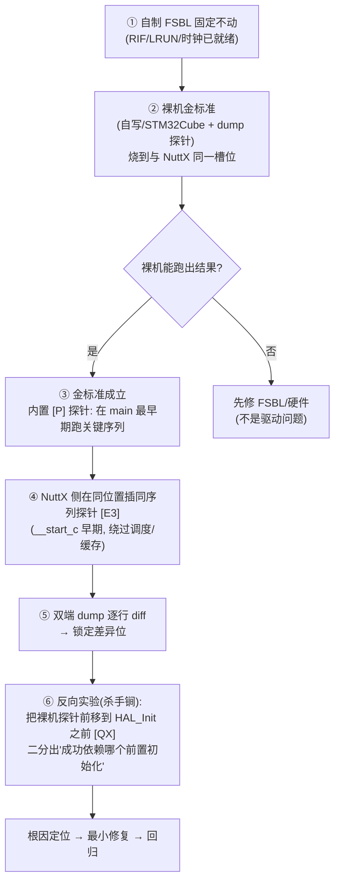

# Peripheral Bring-up Debug（金标准逐位对照法）

## 适用与不适用

**适用**：同一板子、同一启动链（如自定义 FSBL）下，参考实现（裸机 HAL/LL、厂商 demo）**已实测跑通**，
而 RTOS（NuttX 等）驱动失败；现象以「状态机冻结 / 超时 / 无响应 / 无数据」为主。

**不适用**：硬件损坏或焊接问题的纯物理排查；单端即可复现的纯逻辑 bug。

实战验证案例（详见 `references/`）：

| 案例 | 根因 | 文档 |
|------|------|------|
| DCMIPP + IMX335 摄像头黑屏 | RCC IC17/IC18 **时钟源 SEL 宏错误**（PLL2→PLL1）：值一致 ≠ 源一致 | `references/case-camera.md` |
| SDMMC1 + TF 卡识别不了 | **8 项根因链**：VDDIO4 供电域、GPIO 时钟门控、ACMD6、HWFC、FIFO 流控、块驱动返回值语义… | `references/case-sdmmc.md` |
| 隐性坑总表（可扩展） | 时钟门控/供电域/SEL/复位/协议步骤/流控/API 约定 7 类检查项 | `references/hidden-enables.md` |

## 三条核心定律

1. **「寄存器值一致 ≠ 行为一致」** —— 差异最常藏在**使能位 / 门控位 / 供电域**，不在配置值本身。
2. **差异必然可定位** —— 同硬件同环境一个成功一个失败，必有一个可观测的位级/时序级/步骤级差异；
   找不到，只是「还没 dump 到那里」。
3. **结论只能来自实验** —— 每个假设用「单变量 + 干净状态」实验闭环；不接受推测，不接受「应该没问题」。

## 核心战术：同 FSBL 双世界对照法（本项目特色）

> 常规做法是「查找厂商 demo 作参考」；本战术更进一步——
> **自己在同一条 FSBL 启动链上造一个裸机金标准，并把它变成可编程探针。**

**为什么强**：把「环境问题（FSBL/时钟/供电/引脚）」与「驱动问题（协议/框架/API）」**彻底分离**。
裸机在同 FSBL 下成功 ⇒ 硬件+启动链已被证明 OK ⇒ 后续所有差异必在驱动侧；
裸机也失败 ⇒ 问题在启动链/硬件，不必陷入驱动细节。

**六步操作**：

| 步 | 操作 | 要点 |
|----|------|------|
| ① | 固定 FSBL | 调试期间**不改 FSBL**（它是共同基线） |
| ② | 造裸机金标准 | 自写或 STM32Cube 生成；烧到与 RTOS **同一槽位**；先用它验证硬件 |
| ③ | 裸机加探针 | 在最早期（`main` 开头/`HAL_Init` 前后）跑关键序列并 dump |
| ④ | NuttX 对等探针 | `__start_c` 早期（调度器/D-Cache 之前）跑**完全相同**的序列 |
| ⑤ | 双端 diff | 同寄存器、同时点、同格式，逐行对比 |
| ⑥ | **反向实验** | 把裸机探针**前移**到更早阶段（如 `HAL_Init` 之前）→ 若失败，说明"裸机成功依赖某前置"，差分即锁根因 |

**实战威力**（本战法直接命中两例）：
- **SDMMC/VDDIO4**：裸机 `[QX]`（HAL_Init 前）失败 + `[P]`（HAL_Init 后）成功
  ⇒ 差集 = `HAL_MspInit` 的 `HAL_PWREx_EnableVddIO4()` ⇒ 终极根因。
- **摄像头 IC17/IC18**：裸机/ NuttX 同时点 dump 逐位 diff，捕获 **SEL 位**（分频一致但时钟源不同）。

详细实施步骤、探针矩阵与反向实验设计见 `references/same-fsbl-golden-method.md`。

## 工作流（4 Phase）

### Phase 0 — 建立金标准与双端 dump 通道

目标：让「成功」与「失败」两个世界**可逐行 diff**。

1. **金标准必须是「铁证」**：参考程序在本板本 FSBL 下**实际跑出结果**（不只是编译通过），
   并按上方「同 FSBL 双世界对照法」为裸机侧加好早期探针。
   例：`baremetal_tfcard` 能打印 `LogBlockNbr=30535680`，才配叫金标准。
2. **双端 dump 工具**（最小的 UART 直写函数即可，绕过 RTOS 日志系统）：
   - 打印**同一组寄存器、同顺序、同格式**（16 进制 8 位大写），才能逐行 diff；
   - 常见 dump 集：`ENV(CTRL/PRIMASK/MPU_CTRL/CCR/SCTLR/MAIR/SAU/MSP/PSP)`、
     `RCC(CFGR/CFGR2/PLL/LSCO…IC…/DIVENR/ENR/RSTR/SEL)`、
     `GPIO(MODER/AF/OSPEEDR/PUPDR)`、外设核心寄存器、`MPU[0..7] RBAR/RLAR`。
3. ⚠️ **探针自身必须「干净」**：
   - 配置 GPIO 前先开**端口时钟**，否则写入被门控丢弃；
   - 探针跑完必须**复位外设**（RSTSR/RSTCR），否则残留冻结状态污染后续所有实验。

### Phase 1 — 全量寄存器 diff（双端输出并排对比）

1. 两端各烧一次，抓完整启动日志，逐行 diff；
2. 列出**每一处**差异（哪怕是「看似无关」的位，如 `DIVENR.IC16EN`、`AHB5ENR.DMA2DEN`）；
3. 对每处差异标注：`值差异 / 时序差异（打印时点不同）/ 无关`；
4. 优先怀疑：**SEL 类位（源选择）、EN 类位（门控）、SV 类位（供电有效）、DIVEN 类位（分频器使能）**。

原始设备寄存器也可随手验证：`pdftotext RMxxxx.pdf` 后 grep，
或用 CMSIS 头（`stm32xxxx.h`）+ HAL 源（`*_hal_*.c`）**逐字**核实位定义——不要凭记忆。

### Phase 2 — 单变量最小实验（二分排除）

铁律：

1. **单变量**：一次实验只动一个差异项；
2. **干净状态**：实验前先复位目标外设。⚠️ **在被上一轮实验冻结的外设上做实验，结果是无效的**
   （实战教训：`[E3B]`/`[E3C]` 因未复位而全部无效）；
3. **由简到繁**：清一个使能位 → 补一个时钟位 → 对齐时序 → 对齐协议步骤；
4. **实验环境切换**必须用裸汇编（naked function）：⚠️ 禁止在 C 函数执行**中途**切换 `CONTROL.SPSEL`
   或 SP —— 栈帧会立即错乱（实战教训：切栈后读到垃圾值 + `irq_unexpected_isr`）。

每轮实验记录：`假设 → 变量 → 干净化手段 → 结果 → 结论（排除/命中）`。

### Phase 3 — 隐性依赖清单（逐类排除）

完整检查表见 `references/hidden-enables.md`。7 类必查：

| 类别 | 典型陷阱 | 现象 |
|------|---------|------|
| 时钟门控 | 端口/外设时钟未开，寄存器写被**静默丢弃** | 读回复位值 / 外设无反应 |
| 供电域 | VDDIO2/3/4/5 的 `SV` 位未置，引脚**无法驱动电平** | 一切配置正常但引脚不动 |
| 时钟源 SEL | 宏编码错：**值一致但源不同** | 时钟频率/行为异常 |
| 复位残留 | 前一次实验/崩溃的冻结状态机 | 后续实验/驱动全失败 |
| 协议步骤 | 数据路径启动顺序、必要附属命令缺失 | 命令通过但数据阶段超时 |
| 流控交互 | 软件 FIFO 读取策略与硬件流控不匹配 | 传到一半冻结 |
| API 约定 | RTOS 框架返回值/回调语义 | 功能全对但上层 -ENODEV |

### Phase 4 — 修复 + 回归 + 清理

1. 修复对齐金标准，保持**最小差异原则**；
2. **全链路回归**：初始化 → 数据面 → 框架注册 → 应用端到端；
3. 清理诊断探针（保留功能性修复），把根因链写进项目文档；
4. 把新命中收录回 `references/hidden-enables.md` 与本表。

## 反模式（禁止行为）

- ❌ 在被冻结/污染的外设上做实验（无复位）
- ❌ 在 C 函数中途切换 SP/SPSEL 等执行环境
- ❌ 用「错误日志没打印」推断「没执行」（`ferr` 可能被编译级过滤——检查 `CONFIG_DEBUG_*`）
- ❌ 只比「寄存器值」不比「使能路径」（门控/供电/SEL）
- ❌ 修复一项后不回归全链路就让用户验证
- ❌ 凭记忆引用寄存器位定义（必须查 CMSIS/HAL/RM 原文）

## 交付物模板

调试收尾时输出三件套：

1. **差异清单表**：`寄存器 | 位 | 金标准值 | 驱动值 | 结论`；
2. **根因链**：按发现顺序编号，每项 = 现象 → 证据 → 修复；
3. **前端条件核查表**：目标应用（如 `cam_save`）依赖的每项系统能力 + 验证方式 + 状态。
